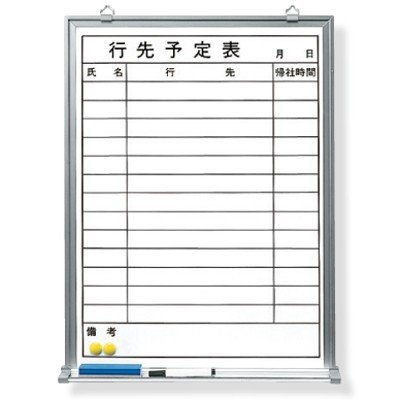
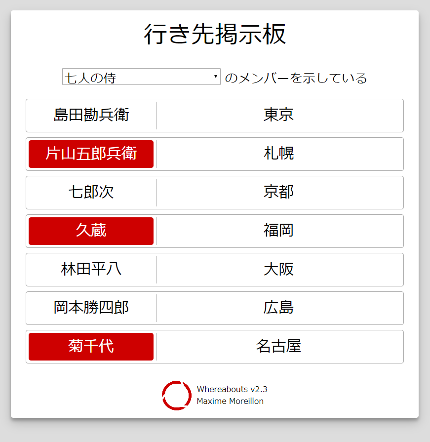

# 行先掲示板 / Whereabouts display board

Many Japanese companies use whiteboards to display the whereabouts of team members.
Those can be useful when quickly trying to figure out if a member is in the office, on a business trip, etc.

  

However, because of COVID-19, more and more employees work from home and can thus not see the whiteboards anymore.
This application offers a solution to the problem by providing the same features but as a web application.
Here, the whereabouts of team members are displayed on a single page application (SPA) and can be easily edited from any device.
The wherebouts are stored in a MongoDB database and their changes are broadcast via WebSockets to all connected clients for real-time updates.

  

This repository contains the source-code for the back-end of the application. The GUI is developed independently and its the object of its own repository.

## API

| Route          | Method    | Query/body                        | Description                                                           |
| -------------- | --------- | --------------------------------- | --------------------------------------------------------------------- |
| /users/USER_ID | PATCH/PUT | current_location, presence (JSON) | Updates the whereabouts of user with ID USER_ID                       |
| /update        | GET       | token, presence, current_location | Updates the whereabouts of user identified by the provided user token |
